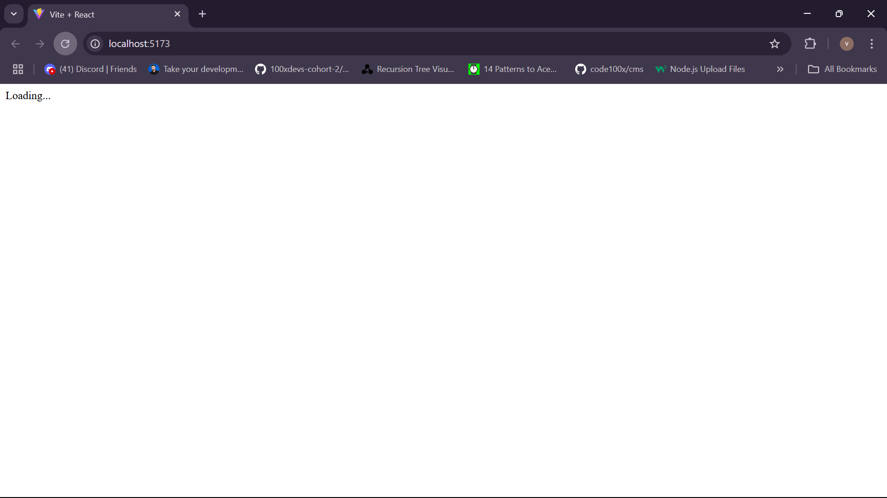
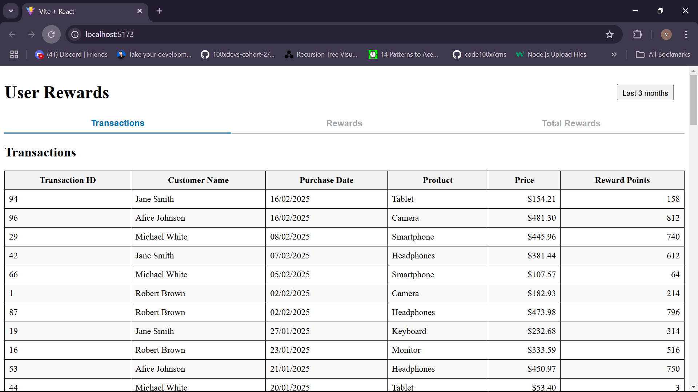
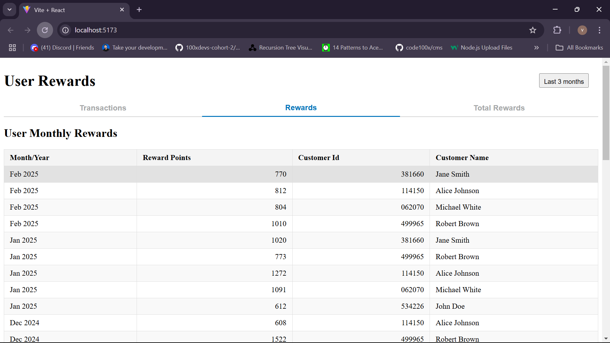
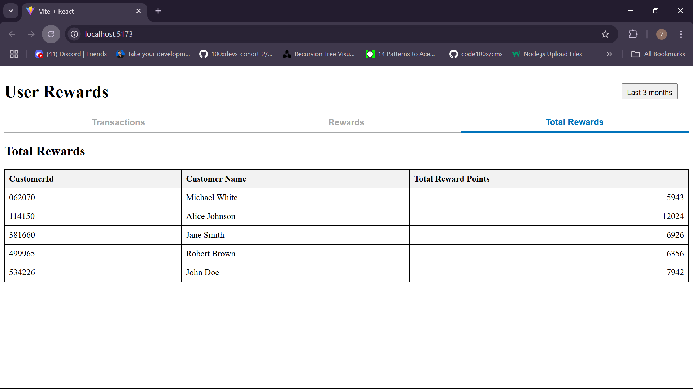
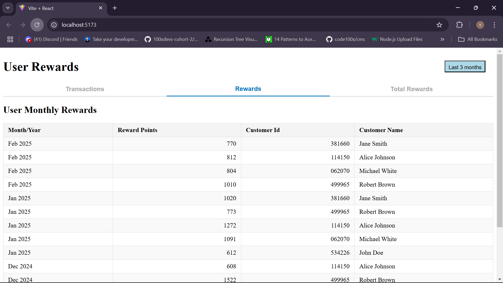

# User Rewards Dashboard

This is a React-based web application that calculates and displays reward points earned by customers based on their transactions. The app fetches transaction data, processes reward points, and presents the information in tabular format.

## Features

- Fetches transaction data from an API.
- Calculates reward points based on the purchase amount.
- Displays transactions in a table format.
- Aggregates reward points by month and year.
- Shows total reward points for each customer.

## Tech Stack

- React.js
- JavaScript (ES6+)
- HTML & CSS

## Installation

Clone the repository:

```bash
git clone https://github.com/your-repo/user-rewards-dashboard.git

Install dependencies:

```bash
npm install

Start the development server:

```bash
npm run dev

Open your browser and go to:

http://localhost:3000

Project Structure
📁 user-rewards-dashboard
│── 📁 src
│   │── 📁 components
│   │   │── RewardsTable.js
│   │   │── TotalRewardsTable.js
│   │   │── TransactionTable.js
│   │── 📁 utils
│   │   │── calculateRewards.js
│   │   │── mockData.js
│   │── App.js
│   │── index.js
│── 📄 package.json
│── 📄 README.md


Reward Points Calculation
Customers earn:

2 points for every dollar spent over $100.

1 point for every dollar spent between $50 and $100.

No points for transactions $50 or below.







